<p align="center">
  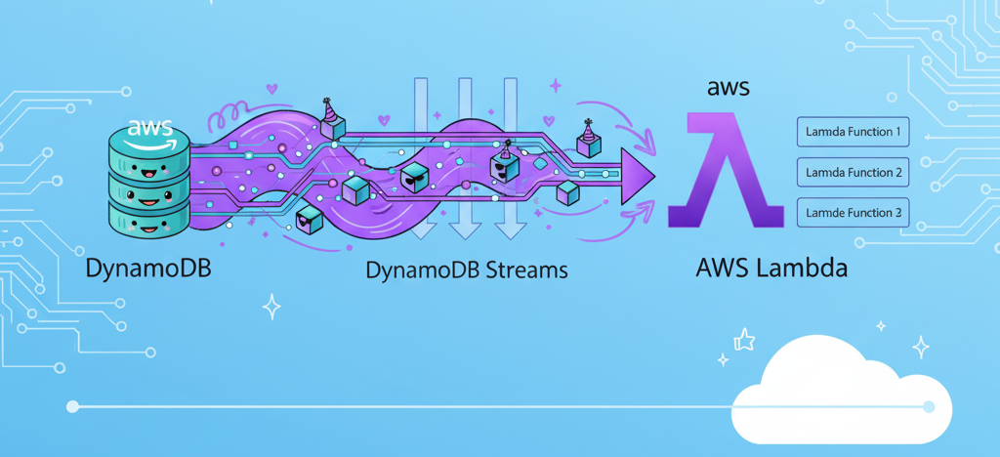</a>
  <h1 align="center">
    Experiments Monorepo: DynamoDB Queue to Lambda (vs SQS) experiment
  </h1>
  <p align="center">
    A DynamoDB tasks queue that triggers a Lambda. How does it compare to the more common
     SQS-Lambda pattern?
  <p>
</p>

<br>

🎯 Goal
=======
The pattern `SQS > trigger > Lambda` is great, but it incurs cost due to the polling 
 (see section "SQS polling cost").

A valid alternative is the pattern `DynamoDB > trigger > Lambda`, which is cheaper as
 the polling is free.

The goal here is to test the pattern DynamoDB-Lambda, under 3 features:
 - **concurrency**: if a producer enqueues 100 tasks to DynamoDB simultaneously, are
    many consumer Lambdas started concurrently?
 - **order**: can I specify that some tasks must be processed by Lambda sequentially
    with FIFO order?
 - **retry**: if a Lambda consumes a task, but it fails, is the task retried
    automatically?

Results show that all questions have positive answers.

Note on trigger: the trigger is actually DynamoDB Streams (`AWS::DynamoDB::Table.StreamSpecification`) 
 for Lambda Event Source Mapping (`AWS::Lambda::EventSourceMapping`). And for SQS the
 trigger is SQS for Lambda Event Source Mapping (`AWS::Lambda::EventSourceMapping`).

Actual example DynamoDB-Lambda: [botte-be](https://github.com/puntonim/botte-monorepo/tree/main/projects/botte-be)


📐 Architecture
================


✨ Conclusions
==============
The pattern DynamoDB-Lambda is great.

It behaves similarly to the SQS-Lambda pattern in regard to *concurrency*, *order*
 and *retry*.

It has the advantage that polling is free of charge, which makes it completely free for
 small, non-critical projects.

I haven't tested other features like reliability and speed of delivery: I expect 
 a proper queuing system like SQS to outperform DynamoDB.

Note: the solution DynamoDB-Lambda solves the problem of a Lambda in a VPC, as well.
 That is a pattern that I use for Lambdas with SQLite on EFS (that requires VPC). And
 for VPCs, connection to the Internet and other AWS services requires expensive things
 like internet gateway, NAT or PrivateLink. But VPCs can connect to DynamoDB and S3 
 (only these 2 services) via a VPC Gateway Endpoint for free. So in the end: any Lambda
 in a VPC can connect to Botte DynamoDB interface by using a free VPC Gateway Endpoint
 (and Botte DynamoDB client). See contabel project in patatrack-monorepo (private and
 now archived) for the VPC setup with Serverless.


💯 Results
==========

I focussed my tests around 3 features: (a) concurrency, (b) order and (c) retry.

It's important to read the section "How it works" to understand how DynamoDB-Lambda
 works.

A. CONCURRENCY
--------------
➡️ TLDR: 28-36 concurrent Lambdas processed 100 tasks with unique PKs.

✨**Lambda can process only records with different PK (partition key) concurrently**.✨\
While records with the same PK will be processed sequentially, with the order determined
 by SK (sort key, alphabetically).

The goal of these 2 tests is to check the concurrency of the Lambdas processing tasks.

I wrote a producer that enqueues 100 messages to the DynamoDB table quickly (with
 threads). Each message has a unique PK (to enable concurrency) and contains a payload
 with a unique text, which is a sequential number like "001" and "097".\
A Lambda function triggered by DynamoDB, reads messages in the batch from the
 DynamoDB Stream, gets the texts (numbers), and writes files in S3 with those numbers
 as file names.

Run the producer with: `$ poetry run python scripts/ddb_producer_parallel.py`

### Test #1: no batching, to test max concurrency
In [serverless.py](serverless.yml):
```yml
functions:
  dynamodb-parallel:
    events:
      - stream:
          batchSize: 1 # Max batch size.
          batchWindow: 0 # Seconds to wait (while collecting the batch) before invoking Lambda.
...
```
First I tested the **max concurrency**, so no batching in DynamoDB Stream.
So 1 Lambda is instantly triggered for each single task enqueued to DynamoDB.

Results show 100 invocations (as expected), 28 concurrent Lambdas, with 0 errors and
 avg duration of 1.2 sec:
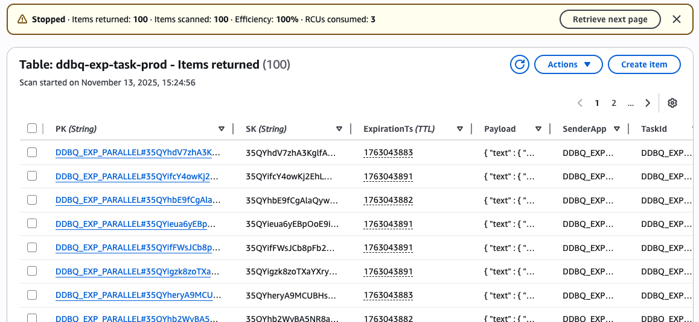
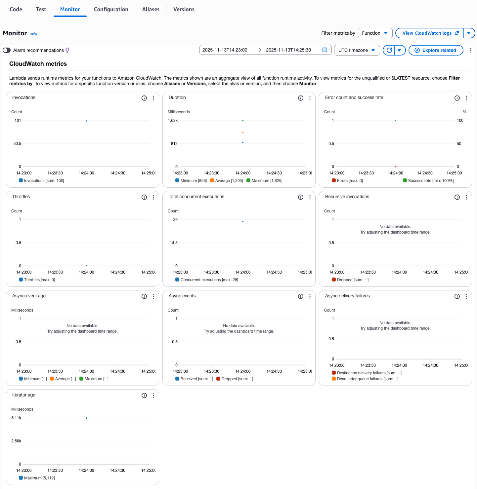

All 100 files were created in S3, within 6 seconds:
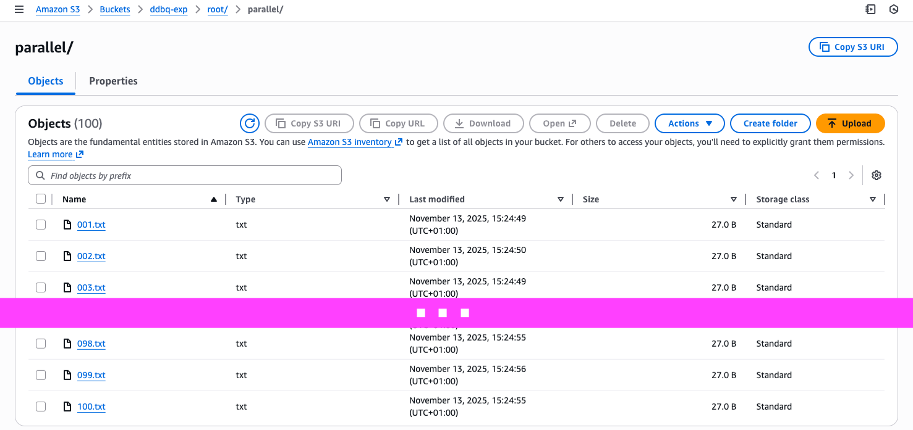

There were indeed 28 logs (= # concurrent Lambdas) in CloudWatch:
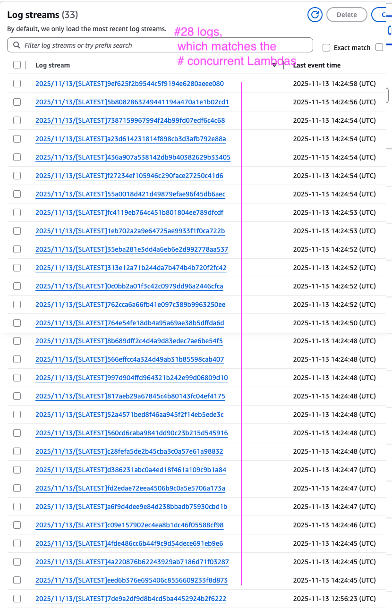
[One of these logs](docs/img/parallel1-log.csv) shows that that specific Lambda was
 invoked 5 times with 031, 019, 077, 100, 057.
Notice how the order is scrambled because all records have different PK (partition key),
 as expected!

### Test #2: with batching
In [serverless.py](serverless.yml):
```yml
functions:
  dynamodb-parallel:
    events:
      - stream:
          batchSize: 100 # Max batch size.
          batchWindow: 10 # Seconds to wait (while collecting the batch) before invoking Lambda.
...
```
I tested the concurrency, **with batching** in DynamoDB Stream.
So a batch is built with up to 100 messages or up to 10 secs of wait (to collect
 and group records), and 1 batch triggers 1 Lambda.

Results show 37 invocations, 36 concurrent Lambdas, with 0 errors and avg duration
 of 3.3 secs:
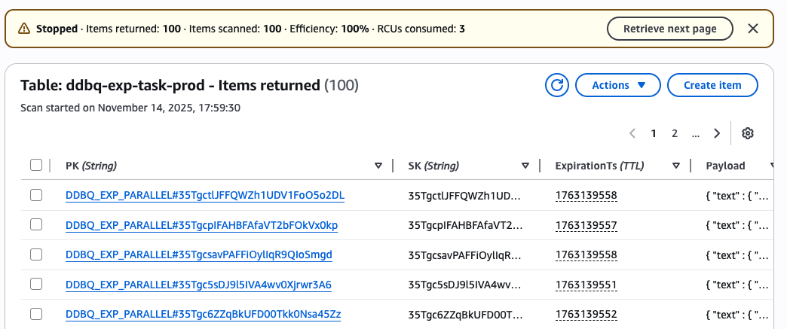
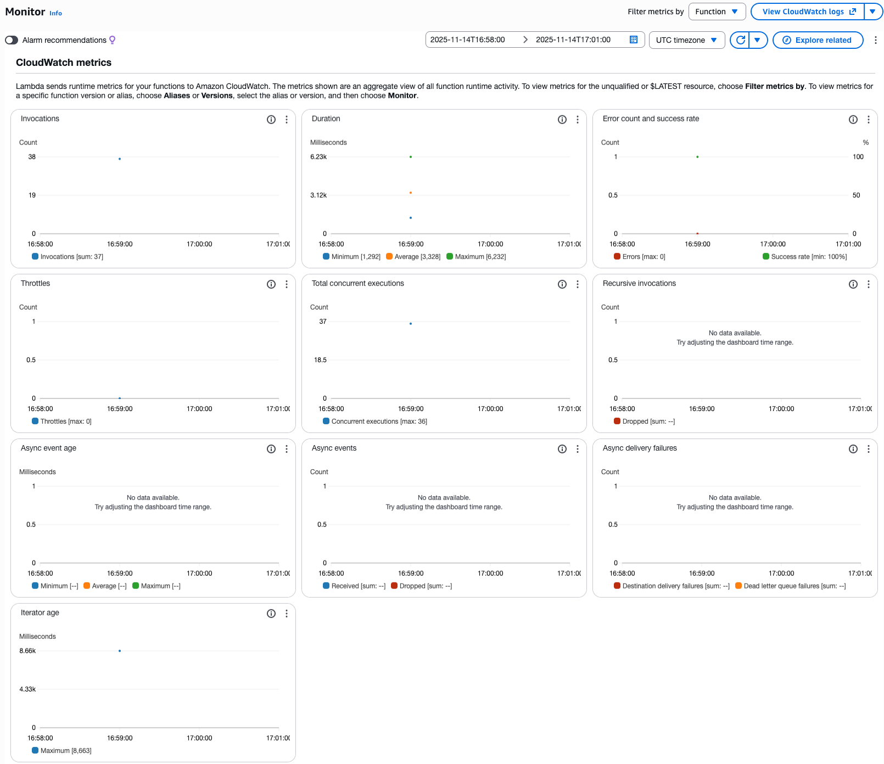

All 100 files were created in S3, within 5 seconds:
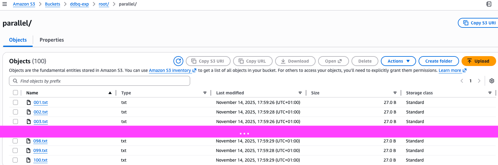

There were indeed 37 logs (= # Lambda invocations) in CloudWatch:
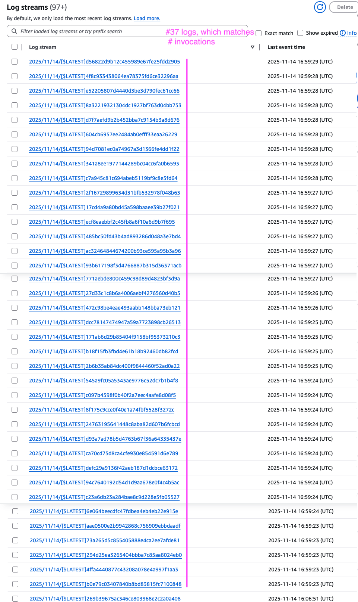
[One of these logs](docs/img/parallel2-log.csv) shows that that specific Lambda was
 invoked 1 time with 4 tasks: 045, 005, 061, 088.
Notice how the order is scrambled because all records have different PK (partition key),
 as expected!


B. (FIFO) ORDER
---------------
➡️ TLDR: Lambda processed tasks with the same PK in FIFO order.

Lambda can process only records with different PK (partition key) concurrently.\
While ✨**records with the same PK will be processed sequentially**✨, with the order
 determined by SK (sort key, alphabetically).

The goal of this test is to ensure the FIFO order is respected by the Lambdas processing
 tasks.

I wrote a producer that enqueues 100 messages to the DynamoDB table quickly (with
 threads). Each message contains a payload with a unique text, which is a sequential
 number like "001" and "097".\
A Lambda function triggered by DynamoDB, reads messages in the batch from the
 DynamoDB stream, gets the texts (numbers), and writes files in S3 with those numbers
 as file names.\
Tasks are built such that:
 - 40 tasks have a **random and unique PKs** (partition key), so Lambda should process
   them concurrently (Lambda process only records with different PK concurrently).
 - 5 tasks have the same PK (different from the other groups), so Lambda should process them in FIFO order.
 - 10 tasks have the same PK (different from the other groups), so Lambda should process them in FIFO order.
 - 15 tasks have the same PK (different from the other groups), so Lambda should process them in FIFO order.
 - 30 tasks have the same PK (different from the other groups), so Lambda should process them in FIFO order.

Actually the order is not FIFO, but is determined by SK (sort key) alphabetically,
 but the SKs are built with Ksuid (timestamps + random uuid that are alphabetically
 sorted by timestamp).

Run the producer with: `$ poetry run python scripts/ddb_producer_parallel.py`

In [serverless.py](serverless.yml):
```yml
functions:
  dynamodb-order:
    events:
      - stream:
          batchSize: 1 # Max batch size.
          batchWindow: 0 # Seconds to wait (while collecting the batch) before invoking Lambda.
...
```

Results show 100 invocations (as expected), 18 concurrent Lambdas, with 0 errors and
 avg duration of 1.2 sec:
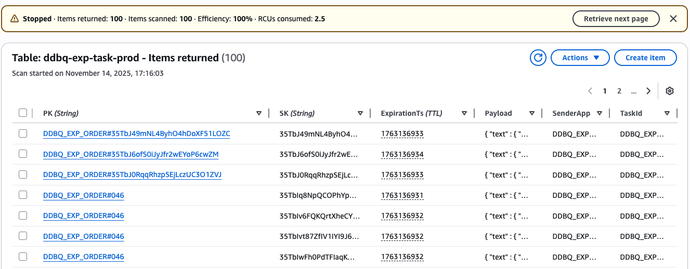
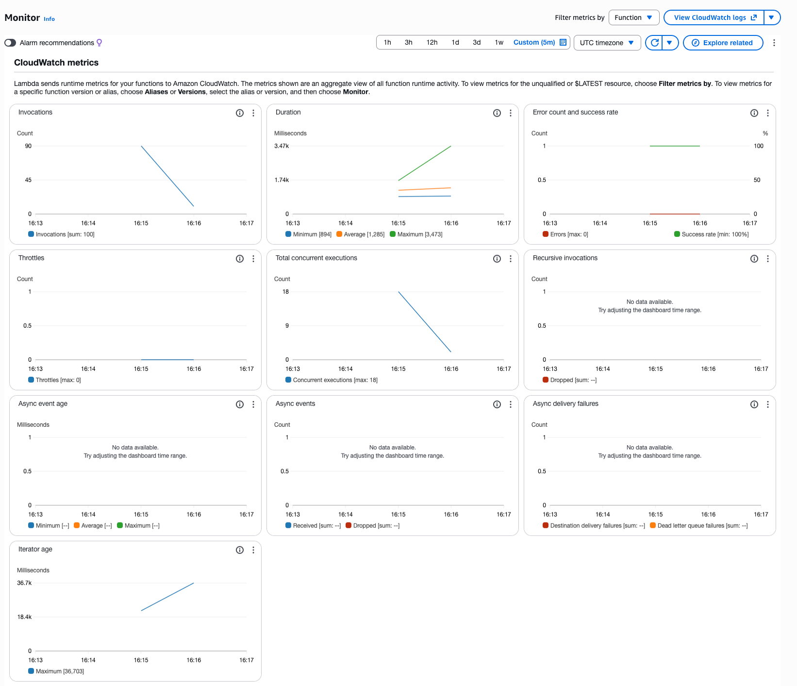

All 100 files were created in S3, following the expected FIFO order:
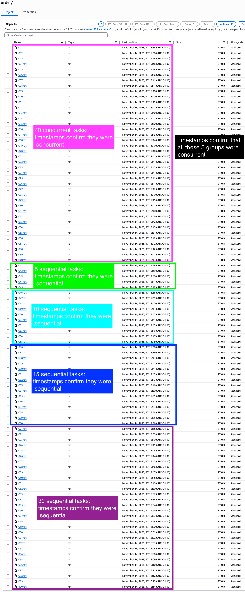

There were indeed 18 logs (= # concurrent Lambdas) in CloudWatch:

[One of these logs](docs/img/order-log.csv) shows that that specific Lambda was
 invoked 4 times with 041, 042, 043, 039.
Notice how the order is FIFO for 41-43 but scrambled with 39, as expected!


C. RETRY
--------
➡️ TLDR: Lambda retried failed tasks.

The goal of this test is to ensure that if a Lambda fails (raises an exception) while
 processing a task, then a retry is happening.\
Note: actually all the tasks in the batch received by the Lambda is retried.

I wrote a producer that enqueues 1 message to the DynamoDB table with text "001".\
The Lambda function triggered by DynamoDB, reads the message in the stream, and
 searches in S3 the file 001-retry-1.txt: if it doesn't exist it creates it and then
 fails by raising an exception. So the Lambda is retried later on, for 5 times,
 and on the 5th retry, the Lambda succeeds (by detecting the presence of all files
 001-retry-{i}.txt with i from 1 to 4).

Run the producer with: `$ poetry run python scripts/ddb_producer_retry.py`

In [serverless.py](serverless.yml):
```yml
functions:
  dynamodb-retry:
    events:
      - stream:
          batchSize: 100 # Max batch size.
          batchWindow: 3 # Seconds to wait (while collecting the batch) before invoking Lambda.      
          maximumRetryAttempts: 7
          destinations:
            onFailure:
              arn: ${self:custom.awsWatchdogSnsErrorsArn}
              type: sns            
...
```

Results show 1 concurrent Lambda of course, with many errors (I was expecting 4 errors,
 but the chart shows 3):
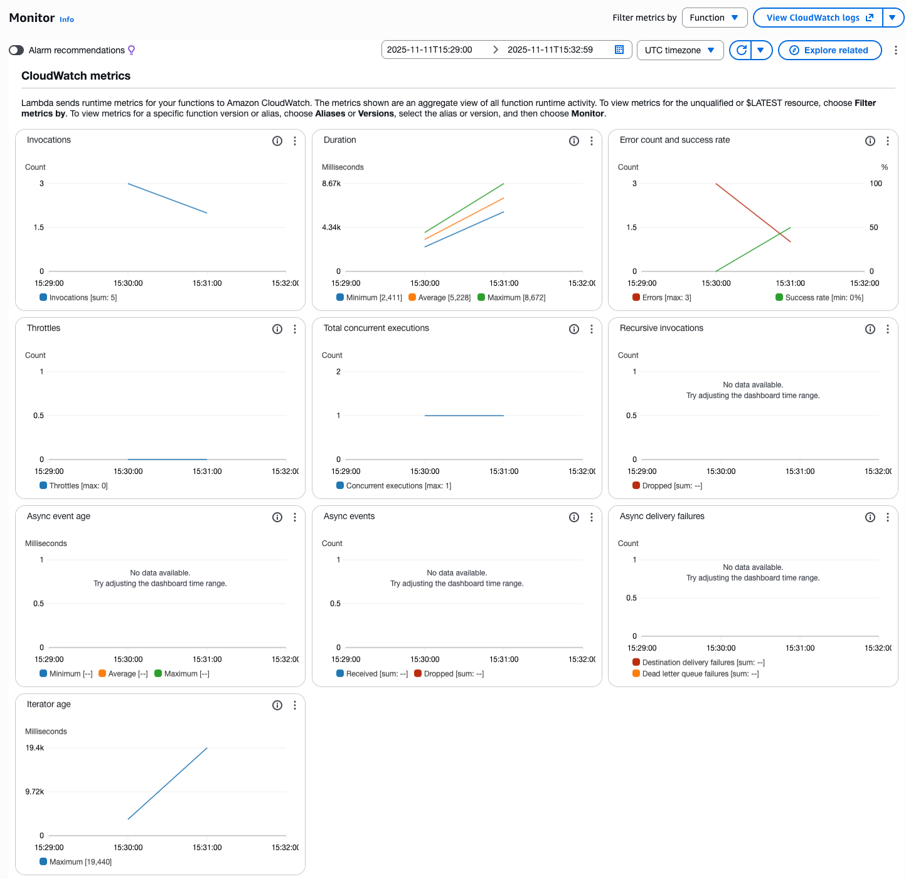

All the expected files were written to S3:
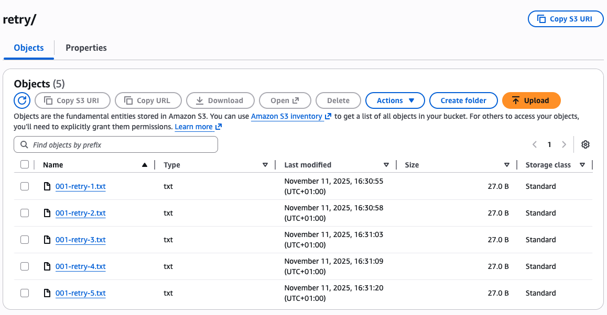

And the logs show exactly the 5 retries and the 4 failures (exceptions):
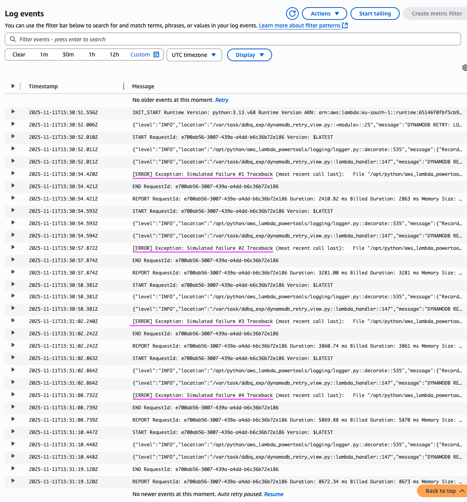

Also I got the emails for the failed Lambdas as email from `aws-watchdog`.


🔭 How it works
===============

## How `SQS > trigger > Lambda` works

Docs: https://docs.aws.amazon.com/lambda/latest/dg/with-sqs.html

**Batch**\
Lambda polls the SQS queue and invokes the function *synchronously*, waiting for the 
 result. Lambda receives these events one batch at a time (a batch is a group of
 messages dequeued from SQS), and invokes the function once for each batch. The size of
 the batch and the batch window (how long to wait while collecting and grouping messages
 in a batch before invoking the function) are configurable.

**Retry**\
When the function successfully processes all messages in a batch, Lambda deletes its
 messages from the queue. In case of errors in one message, all messages in the batch
 are placed back in the queue and re-tried later on. The number of retries is also
 configurable. AWS Lambda Powertools provides a Batch Processor utility to help
 handling partial batch response (errors in a batch):
 https://docs.aws.amazon.com/powertools/python/latest/utilities/batch/

**Polling**\
Lambda generates 15 requests per minutes by polling a SQS queue (even when getting
 empty receives, indeed). Note that using different values for batch size (eg. 100)
 and batch window (eg. 10 sec) does not seem to affect the 15 req/min because it's the
 Lambda event source mapping that aggregates messages in SQS and puts together the
 batch. These poll requests incur a cost, see section "SQS polling cost".

**Order**\
FIFO queues are available in SQS.

**Concurrency**\
Non-FIFO queue are processed by more Lambdas concurrently.

**Duplicates**\
Lambda event source mappings process each event at least once, and duplicate
 processing of records can occur. To avoid potential issues related to duplicate events,
 we strongly recommend that you make your function code idempotent.


## How `DynamoDB > trigger > Lambda` works

Docs: https://docs.aws.amazon.com/lambda/latest/dg/with-ddb.html

**Batch**\
Each time a DynamoDB table is update, its Amazon DynamoDB stream is also updated. Lambda
 polls the stream 4 times per second. Lambda receives these events in batches (a batch
 is a group of records from DynamoDB), and invokes the function once for each
 batch. The size of the batch and the batch window (how long to wait while collecting
 and grouping messages in a batch before invoking the function) are configurable.

**Partitions, shards, order**\
Records in DynamoDB are organized in partitions, by the PK (partition key).\
Records within the same PK, are sorted by SK (sort key, alphabetical order).\
When records are inserted (or updated, deleted, etc) in DynamoDB, the Stream is updated.\
Streams have a position, so when polling a stream, Lambda uses the position of the
 last poll and gets all the records edited since then.\
Data in Streams are organized in shards: typically 1 shard per partition (PK).

**IMPORTANT RULE: Lambda processes records in the same shard and with the same PK
 sequentially, following the SK order. This means that concurrency happens only for 
 records with different PKs.**

*Note: actually the rule is that all records with the same PK (partition key) are in the
 same shard. So a shard can contain more PKs, if the number of records in each PK is
 small.*\
https://repost.aws/questions/QU75N_zN9JRpC5HMPBVHL8yA/no-lambda-concurrency-in-dynamodb-stream-trigger-lambda \
https://stackoverflow.com/a/78710735/1969672 \
https://repost.aws/knowledge-center/lambda-functions-fix-dynamodb-streams

**Concurrency**\
**Lambda can process only records with different PK (partition key) concurrently.**\
While records with the same PK will be processed sequentially, with the order determined
 by SK (sort key, alphabetically).

To maximize paralleization (so more Lambdas running simultaneously) use `batchSize: 1`
 and `batchWindow: 0`. The window is how long to wait to assemble a batch.\
Also use `parallelizationFactor: 10` in order to process batches with different PKs,
 but in the same shard, with up to 10 Lambdas.

**Retry**\
When the function successfully processes all messages in a batch, Lambda moves forward
 the StartingPosition in the stream. In case of errors in one message, all messages in
 the batch are re-tried (and the StartingPosition is not moved). The number of retries
 is also configurable.\
AWS Lambda Powertools provides a Batch Processor utility to help handling partial batch
 response (errors in a batch):
 https://docs.aws.amazon.com/powertools/python/latest/utilities/batch/

**Polling**\
Lambda polls the stream 4 times per second. Polling is free of charge, as reported
 [here](https://aws.amazon.com/dynamodb/pricing/on-demand/):
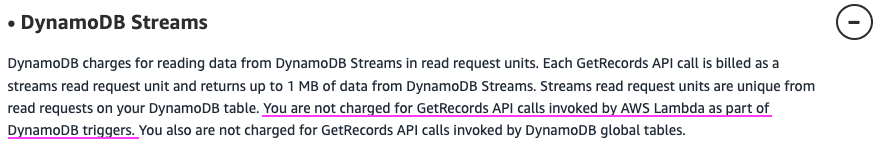

**Duplicates**\
Lambda event source mappings process each event at least once, and duplicate
 processing of records can occur. To avoid potential issues related to duplicate events,
 we strongly recommend that you make your function code idempotent.


## SQS polling cost

These notes were taken on Friday 2023.12.01 10:44:18.

SQS is charged by (million) requests per month (and the first 1M is free).
Note: requests and NOT messages.

A Lambda function triggered by an SQS generates 15 requests per minutes by polling
 (and getting empty receives):
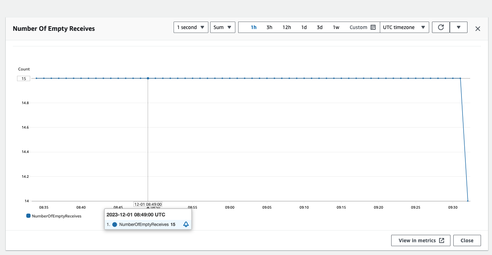
This means `15*60*24*30=648k` requests/month.\
Note that using different values for Batch size (eg. 100) and Batch window (eg. 10)
 does not seem to affect the 15 req/min because it's the Lambda event source mapping 
 (not the function itself) that aggregates messages in SQS and composes the batch.

So 1 SQS+Lambda is free, but more than that will incur costs.
In my case (patatrack-monorepo) with 3 SQS I was charged around $0.30 a month.
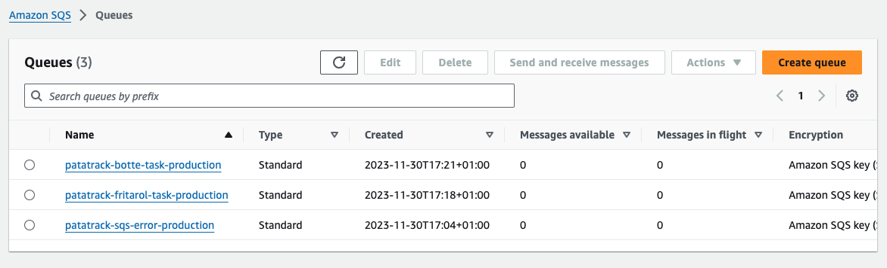
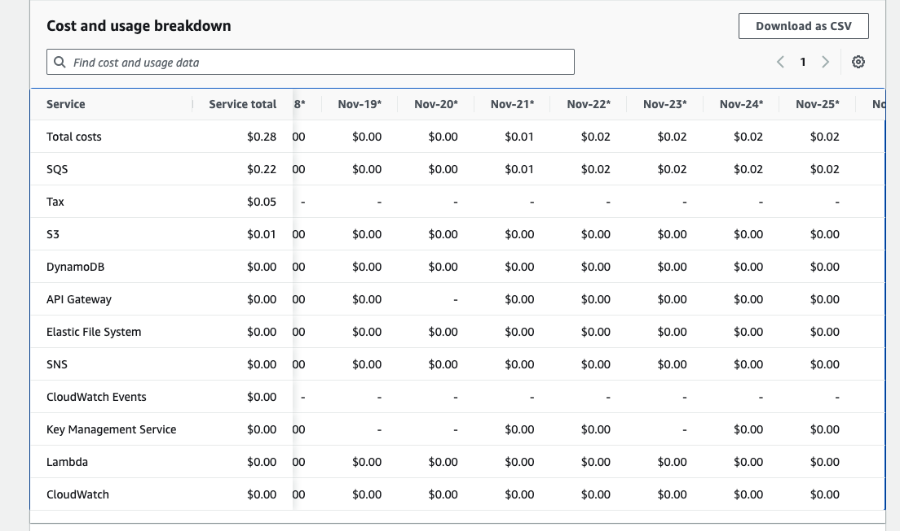


🛠️ Development setup
====================

1 - System requirements
----------------------

**Python 3.13**\
The target Python 3.13 as it is the latest Python runtime available in AWS Lambda.\
Install it with pyenv:
```sh
$ pyenv install -l  # List all available versions.
$ pyenv install 3.13.7
```

**Poetry**\
Pipenv is used to manage requirements (and virtual environments).\
Read more about Poetry [here](https://python-poetry.org/). \
Follow the [install instructions](https://python-poetry.org/docs/#osx--linux--bashonwindows-install-instructions).

**Pre-commit**\
Pre-commit is used to format the code with black before each git commit:
```sh
$ pip install --user pre-commit
# On macOS you can also:
$ brew install pre-commit
```

2 - Virtual environment and requirements
----------------------------------------

Create a virtual environment and install all deps with one Make command:
```sh
$ make poetry-create-env
# Or to recreate:
$ make poetry-destroy-and-recreate-env
# Then you can activate the virtual env with:
$ eval $(poetry env activate)
# And later deactivate the virtual env with:
$ deactivate
```

Without using Makefile the full process is:
```sh
# Activate the Python version for the current project:
$ pyenv local 3.13  # It creates `.python-version`, to be git-ignored.
$ pyenv which python
/Users/nimiq/.pyenv/versions/3.13.7/bin/python

# Now create a venv with poetry:
$ poetry env use ~/.pyenv/versions/3.13.7/bin/python
# Now you can open a shell and/or install:
$ eval $(poetry env activate)
# And finally, install all requirements:
$ poetry install
# And later deactivate the virtual env with:
$ deactivate
```

To add new requirements:
```sh
$ poetry add requests

# Dev or test only.
$ poetry add -G test pytest
$ poetry add -G dev ipdb

# With extra reqs:
$ poetry add -G dev "aws-lambda-powertools[aws-sdk]"
$ poetry add "requests[security,socks]"

# From Git:
$ poetry add git+https://github.com/aladagemre/django-notification

# From a Git subdir:
$ poetry add git+https://github.com/puntonim/utils-monorepo#subdirectory=log-utils
# and with extra reqs:
$ poetry add "git+https://github.com/puntonim/utils-monorepo#subdirectory=log-utils[rich-adapter,loguru-adapter]"
# and at a specific version:
$ poetry add git+https://github.com/puntonim/utils-monorepo@00a49cb64524df19bf55ab5c7c1aaf4c09e92360#subdirectory=log-utils
# and at a specific version, with extra reqs:
$ poetry add "git+https://github.com/puntonim/utils-monorepo@00a49cb64524df19bf55ab5c7c1aaf4c09e92360#subdirectory=log-utils[rich-adapter,loguru-adapter]"

# From a local dir:
$ poetry add ../utils-monorepo/log-utils/
$ poetry add "log-utils @ file:///Users/myuser/workspace/utils-monorepo/log-utils/"
# and with extra reqs:
$ poetry add "../utils-monorepo/log-utils/[rich-adapter,loguru-adapter]"
# and I was able to choose a Git version only with pip (not poetry):
$ pip install "git+file:///Users/myuser/workspace/utils-monorepo@00a49cb64524df19bf55ab5c7c1aaf4c09e92360#subdirectory=log-utils" 
```


🚀 Deployment
=============

### 1. Install deployment requirements

The deployment is managed by Serverless. Serverless requires NodeJS.\
Follow the [install instructions](https://github.com/nvm-sh/nvm#install--update-script) for NVM (Node Version Manager).\
Then:
```shell
$ nvm install --lts
$ node -v > .nvmrc
```
Follow the [install instructions](https://serverless.com/framework/docs/getting-started#install-as-a-standalone-binary)
for Serverless, something like `curl -o- -L https://slss.io/install | bash`.
We currently use version 4.23.0, if you have an older major version you can upgrade Serverless with: `sls upgrade --major`.

Then to install the Serverless plugins required:
```shell
#$ sls upgrade  # Only if you are sure it will not install a major version.
$ nvm install
$ nvm use
```

### 2. Deployments steps

Note: AWS CLI and credentials should be already installed and configured.\

Deploy to **PRODUCTION** in AWS with:
```sh
$ sls deploy
# $ make deploy  # Alternative.
```

To deploy a single function (only if it was already deployed):
```sh
$ sls deploy function -f endpoint-health
```


©️ Copyright
=============

Copyright puntonim (https://github.com/puntonim). No License.
